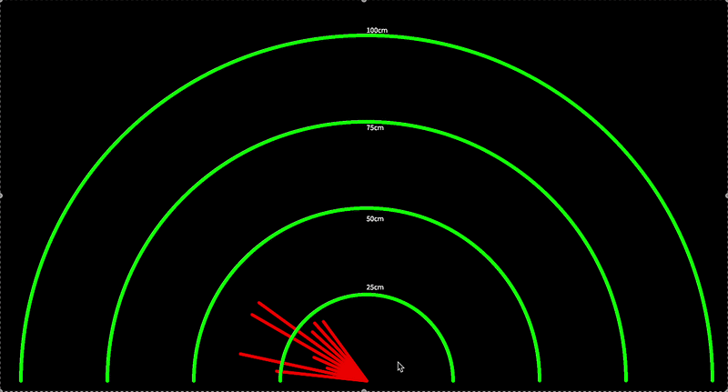

# Arduino Radar

A 2D radar display built from scratch as a winter break project. A servo motor sweeps an HC-SR04 ultrasonic sensor across 180°, sending angle and distance data over serial to a Processing sketch that renders a live radar display.

Built as a first foray into embedded systems and creative coding — no prior C/C++ background going in.

---

## Demo



---

## Hardware

| Component | Role |
|---|---|
| Elegoo UNO R3 | Microcontroller |
| SG90 Servo Motor | Sweeps the sensor |
| HC-SR04 Ultrasonic Sensor | Measures distance |
| Breadboard | Shared power rails |
| Jumper Wires | Connections |

### Wiring

| Component | Pin |
|---|---|
| Servo signal | Digital 9 |
| HC-SR04 TRIG | Digital 10 |
| HC-SR04 ECHO | Digital 11 |
| Servo + sensor power | 5V rail (via breadboard) |

---

## Photos


---

## Software

**Arduino IDE 2.3.10** — uploads the sketch to the Elegoo, handles servo sweep and sensor firing, sends `angle,distance` pairs over serial at 9600 baud.

**Processing 4.5.5** — reads the serial stream, parses angle and distance, converts polar to Cartesian coordinates, and renders the radar display.

---

## How It Works

### Arduino side

The servo sweeps from 0° to 180° and back. Every 6th degree, the HC-SR04 fires a 40kHz ultrasonic pulse and listens for the echo. Distance is calculated from the echo duration:

```
distance_cm = (duration_us × 0.0343) / 2
```

The divide by 2 accounts for the round trip — the sound travels out and back.

Each reading is sent over serial as `angle,distance\n`.

### Processing side

Processing reads each line, splits on the comma, and converts polar coordinates to Cartesian:

```
x = distance × cos(angle)
y = −(distance × sin(angle))
```

The y-axis is negated because Processing's y-axis increases downward, which would otherwise flip the display.

The display clears at angle 0° on each new sweep, giving a clean refresh each pass.

---

## What I Learned

**Phase 1 — Servo / PWM**
Servo position is encoded in pulse width, not voltage. A 1ms pulse = 0°, 1.5ms = 90°, 2ms = 180°. The Arduino `Servo` library abstracts this behind `servo.write(angle)`.

**Phase 2 — Ultrasonic sensor / time of flight**
The HC-SR04 fires a burst of 40kHz sound and measures how long the echo takes to return. `pulseIn()` captures the echo duration in microseconds. Practical range limit is ~400cm.

**Phase 3 — Serial communication as a data protocol**
The Arduino doesn't render anything — it just sends structured data. Processing reads it. They agree on a format (`angle,distance\n`) and a baud rate (9600). The servo needs ~15ms to physically settle before firing the sensor, or readings get tagged to the wrong angle.

**Phase 4 — Processing / coordinate math**
Processing has a `setup()` / `draw()` loop like Arduino. Polar-to-Cartesian conversion uses sin and cos. Processing's inverted y-axis requires negating the y component. Serial data can arrive null on the first frame — always null-check before parsing.

---

## Running It

1. Upload `radar.ino` to the Elegoo via Arduino IDE
2. Close the Serial Monitor (only one program can hold the port at a time)
3. Open `radar.pde` in Processing
4. Check `Serial.list()` output and update the port index if needed
5. Run the Processing sketch

---

## Possible Extensions

- Noise filtering (moving average or median) on the Arduino side
- Sweep speed control via potentiometer
- Proximity buzzer when something enters a threshold distance
- LCD readout showing live angle and distance
